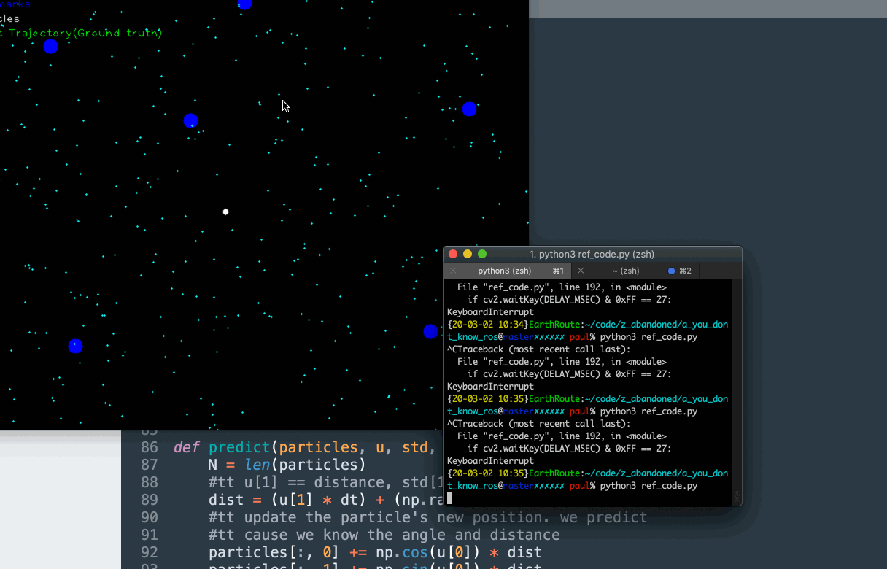
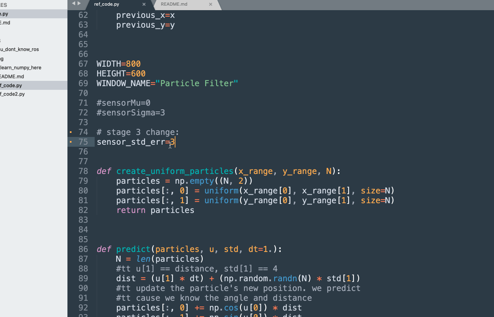
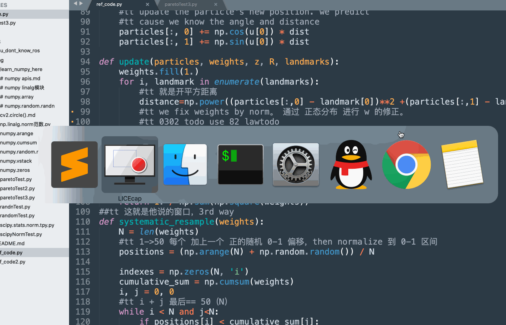
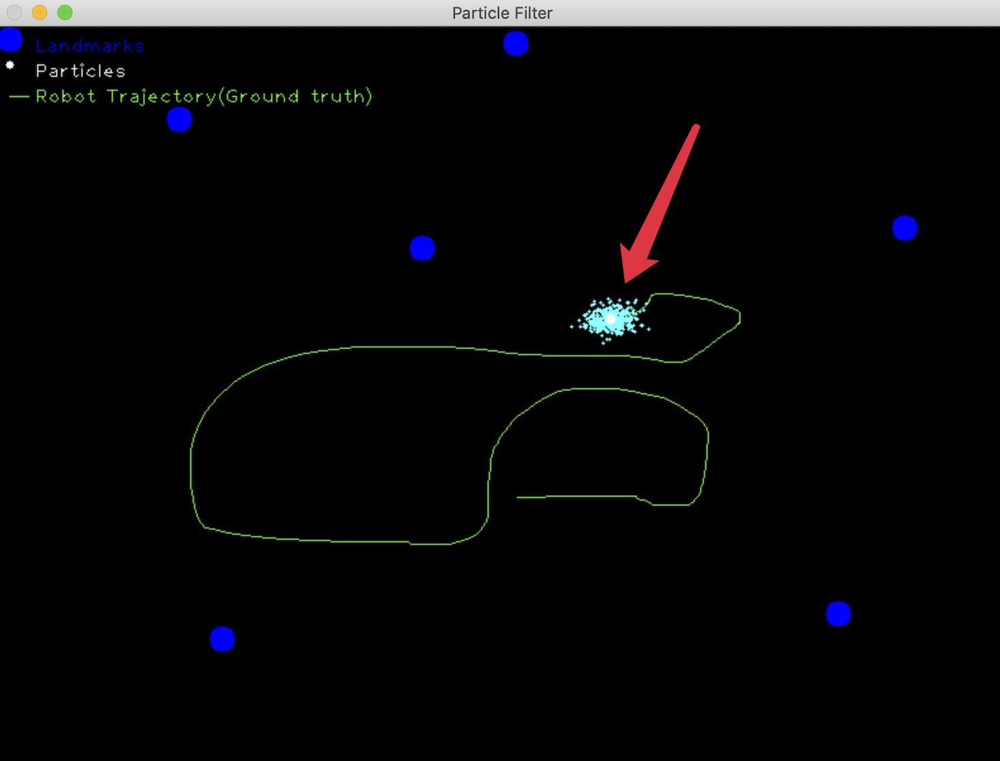
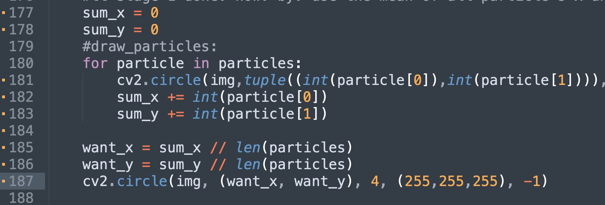

# you dont know ros

[toc]
current stage
stage 4
useful links:
stage 3
stage 2
stage 1
useful res for particle filter
links:
videos:
backup:
pdfs:
ref code:
about python
note!!
Numpy-np.random.normal()正态分布
numpy.random.pareto
numpy linalg模块

a repo for learn *particle filtering*

- related keywords:

马尔可夫，贝叶斯滤波，蒙特卡洛，numpy，scipy，后验概率分布， SIS: Sequential Importance Sampling, 粒子群优化

# current stage

## stage 4

- [x] eliminate the noise effect on locating

思路：TCP round trip time 类似的自适应调整算法。因为每次增量应该相差不大（给定一个稳定的速度），so we have something like:

    this_time_inc_val = (q * last_time_inc_val) + ((1 - q) * this_time_sensor_inc_var)// 0 < q < 1

上式中，q代表你多相信之前的一次数据

- search for **stage 4 change:** in finalCode.py to see changes

### useful links:

https://www.researchgate.net/publication/224218731_Particle_Filtering_With_Dependent_Noise_Processes

## stage 3

- [x] add the sensor noise and to see what happend

seems that bigger noise reduce the latency

here is the `sensor_std_error = 15` situation:

here is the `sensor_std_error = 3` situation:

- search for **stage 3 change:** in finalCode.py to see changes

## stage 2 

- [x] using `pareto`

but here is some delay to locate the robot: aka, you need move longer time than it does in normal distribution way. guess it's the param issue, can we improve it by changing the detail params for `scipy.stats.pareto.pdf(z[i], 1, distance)`??

- search for **stage 2 change:** in finalCode.py to see changes

## stage 1 

- [x] know the exact location of robot 

now we know exactly where the robot is.

we did this by *take a mean of all the particles*

>best estimate based on the particle with the highest weight or take a mean of all the particles

- search for **stage 1 change:** in finalCode.py to see changes

you may find the changes looks like as follow:

# useful res for particle filter

## links:

https://github.com/mjl/particle_filter_demo
https://github.com/mit-racecar/particle_filter
https://github.com/leimao/Particle_Filter

> 粒子滤波的核心思想是随机采样+重要性重采样。既然不知道目标在哪里，那我就随机的放狗（随机采样）。放完狗后，根据特征相似度计算每个地区人和罪犯的相似度，然后在重要的地方再多放狗，不重要的地方就少放狗（重要性采样）。

粒子滤波（Particle Filter）的通俗解释:

https://blog.csdn.net/yq_forever/article/details/62217470

## videos:

https://www.youtube.com/embed/7Z9fEpJOJdc

https://www.youtube.com/embed/TKCyAz063Yc	

### backup:

https://www.bilibili.com/video/av92849889/

https://www.bilibili.com/video/av92879180

## pdfs:

particle filtering docs:

http://web.mit.edu/16.412j/www/html/Advanced%20lectures/Slides/Hsaio_plinval_miller_ParticleFiltersPrint.pdf

https://www.stats.ox.ac.uk/~doucet/doucet_johansen_tutorialPF2011.pdf

## ref code:

cp from 

http://ros-developer.com/2019/04/10/parcticle-filter-explained-with-python-code-from-scratch/

## about python

### note!!

>you can find all the related stuff for how to use `numpy` in subfolder: u_learn_numpy_here

### Numpy-np.random.normal()正态分布

https://www.cnblogs.com/cpg123/p/11779117.html

正态分布（又称高斯分布）的概率密度函数

 
numpy中

numpy.random.normal(loc=0.0, scale=1.0, size=None) 

参数的意义为：

　　loc:float

　　概率分布的均值，对应着整个分布的中心center

　　scale:float

　　概率分布的标准差，对应于分布的宽度，scale越大越矮胖，scale越小，越瘦高

 　 size:int or tuple of ints

　　输出的shape，默认为None，只输出一个值

我们更经常会用到np.random.randn(size)所谓标准正态分布（μ=0, σ=1），对应于np.random.normal(loc=0, scale=1, size)

### numpy.random.pareto

https://www.osgeo.cn/numpy/reference/generated/numpy.random.pareto.html

numpy.random.pareto(a, size=None)

从指定形状的Pareto II或Lomax分布中提取样品。

Lomax或Pareto II分布是一个移位的Pareto分布。经典的帕累托分布可以从lomax分布中通过加1和乘以尺度参数得到。 m （见注释）。Lomax分布的最小值是零，而对于经典的Pareto分布，它是零。 mu ，其中标准帕累托分布有位置 mu = 1 . Lomax也可以被视为广义帕累托分布的简化版本（在Scipy中可用），比例设置为1，位置设置为零。

帕累托分布必须大于零，并且在上面是无界的。它也被称为“80-20法则”。在这个分布中，80%的权重在最小的20%范围内，而其他20%则填充剩余的80%范围。

参数: 
a : 浮点数或类似浮点数的数组
分布的形状。应大于零。

size : int或int的元组，可选
输出形状。如果给定的形状是，例如， (m, n, k) 然后 m * n * k 取样。如果尺寸是 None （默认），如果 a 是标量。否则， np.array(a).size 取样。

返回: 
out : ndarray或scalar
从参数化帕累托分布中提取样本。

参见
scipy.stats.lomax
概率密度函数、分布或累积密度函数等。
scipy.stats.genpareto
概率密度函数、分布或累积密度函数等。
笔记

帕累托分布的概率密度是

p（x）=frac am^a x ^ a+1

在哪里？ a 是形状和 m 规模。

帕累托分布，以意大利经济学家维尔弗雷多·帕累托的名字命名，是一种适用于许多现实世界问题的幂律概率分布。在经济学领域之外，它通常被称为布拉德福德分布。帕累托发展了分布来描述经济中财富的分布。它还可以用于保险、网页访问统计、油田规模和许多其他问题，包括SourceForge项目的下载频率。 [1]. 它是所谓的“肥尾”分布之一。

### numpy linalg模块 

https://www.cnblogs.com/xieshengsen/p/6836430.html

